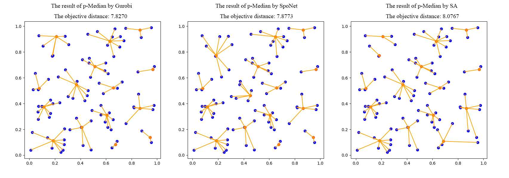
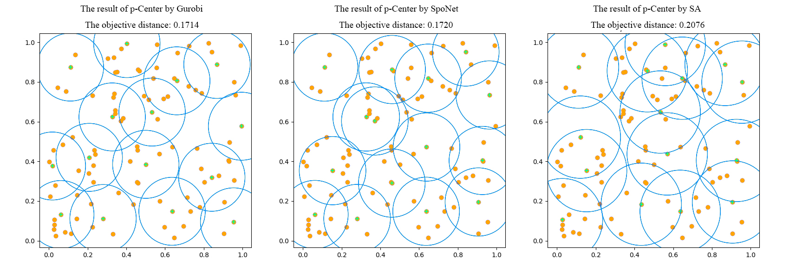
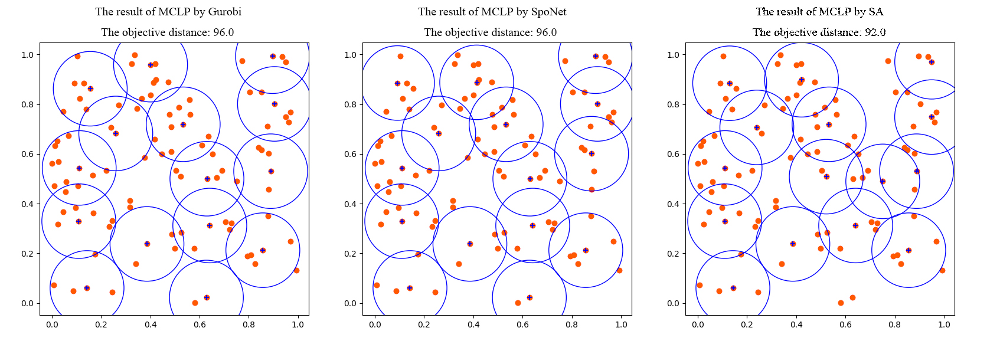
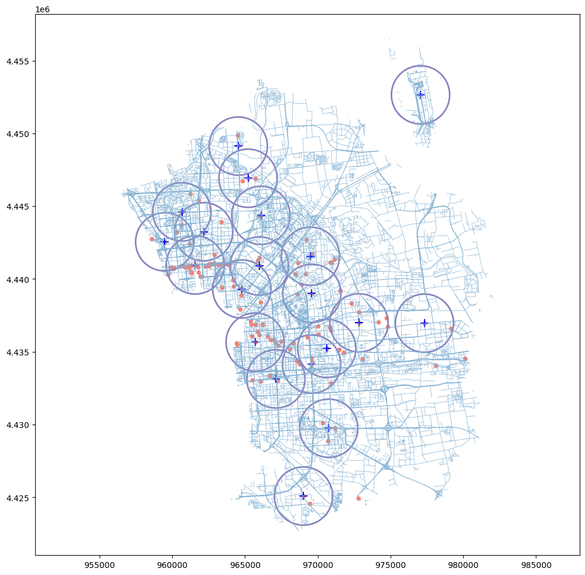
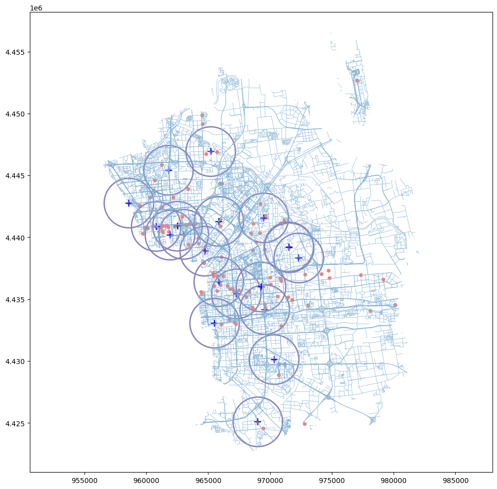

# SpoNet: Learn to Solve Spatial Optimization Problem with Deep Reinforcement Learning
This project is the code for the study: SpoNet: Learn to Solve Spatial Optimization Problem with Deep Reinforcement Learning.
We have established a unified framework for solving p-Median, p-Center, and MCLP.

## update 2023.10.20
Added a case study of the emergency location in file ./emergency_location.

## Dependencies
All experiments were implemented python and run on two RTX3090 GPUs and Intel(R) Xeon(R) Gold 6230 CPU @2.10GHz. 

* Python==3.7
* pytorch=1.11.0+cuda11.3
* SciPy
* tqdm
* [tensorboard_logger](https://github.com/TeamHG-Memex/tensorboard_logger)
* Matplotlib (optional, only for plotting)

## Quick start
Under the ./SPO_V4/ directory to train the SpoNet for p-Median, p-Center, and MCLP.
```bash
python run.py --problem PM --graph_size 20 --p 4 --r 0.32 --run_name 'PM20'
python run.py --problem PC --graph_size 20 --p 4 --r 0.32 --run_name 'PC20'
python run.py --problem MCLP --graph_size 20 --p 4 --r 0.3 --run_name 'MCLP20'
```
## Usage
### Generating datasets
Generating the PM instances with 500 nodes with 15 medians
```bash
python gen_data.py --problem PM --graph_size 500 --p 15
```

### Training
For training the PM instances with 50 nodes and using rollout as REINFORCE baseline:
```bash
python run.py --problem PM --graph_size 50 --run_name 'PM50'
```
### Evalution
To evaluate the PM instances with 50 nodes by sample1280 strategy:
```bash
python eval.py "../data/PM/PM_20.pkl" --decode_strategy sample --width 1280
```

### Plotting
To visualize the solution results of different algorithms for PM problem (Need Gurobi solver)
```bash
python plot_p-Median.py 
```

#### Multiple GPUs
By default, training will happen *on all available GPUs*. To disable CUDA at all, add the flag `--no_cuda`. 
Set the environment variable `CUDA_VISIBLE_DEVICES` to only use specific GPUs:
```bash
CUDA_VISIBLE_DEVICES=0,1 python run.py 
```
Note that using multiple GPUs has limited efficiency for small problem sizes (up to 50 nodes).

#### Warm start
You can initialize a run using a pretrained model by using the `--load_path` option:
```bash
python run.py --graph_size 100 --load_path pretrained/PM_100/epoch-99.pt
```

The `--load_path` option can also be used to load an earlier run, in which case also the optimizer state will be loaded:
```bash
python run.py --graph_size 20 --load_path 'outputs/PM_20/PM20_{datetime}/epoch-0.pt'
```

The `--resume` option can be used instead of the `--load_path` option, which will try to resume the run, e.g. load additionally the baseline state, set the current epoch/step counter and set the random number generator state.

### Visualization results





### Real scenario

